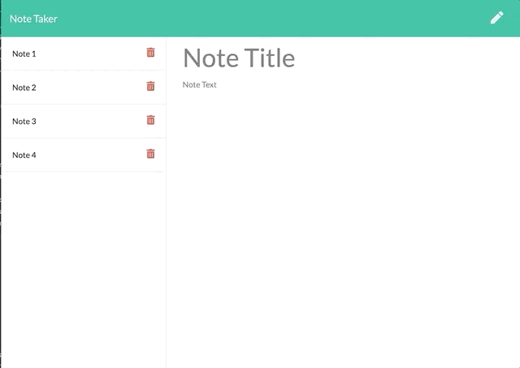

# Note Taker
[](https://github.com/gidmp/)

[](code_of_conduct.md) 


## Description
------

A simple Express.JS based note app that able to take notes and save them and delete eisting notes 

## Table of Contents 
------

* [Installation](#installation)

* [About](#about)

* [Demo](#demo)

* [Author](#author)


## Installation

To install necessary dependencies, run the following command:

```
npm i express

```


## About

This app is a  digital node made with Express.JS backend as it's main theme. The idea of this app is to link the HTML page to the backend server that will communicate with a db file, storing all of the saved notes as a JSON format and establishing express pathing.

The functionality of this app relies on the GET, POST and DELETE method. The Get method were pretty straightforward as all i had to do is connect the current directory with the files and data stored within files in the same directory.

I had more difficulty with the POST method since it had an extra layer where I have to figure out how to attach unique id to each existing and future notes which will be utilized as identifier for the delete function of this app.

I have the most problem with the Delete method since I was struggling on figuring out how to delete a note attached with unique id without messing up with other notes and thier ID. I tried different method like mapping and for loop, but I decided to use filter() to single out the deleted note and re-write the db file with the updated array.

## Demo



## Author
------

**Daniel Luke Tanoeihusada**

* Github : [gidmp](https://github.com/gidmp/)


If you have any questions, please contact me, [Daniel Luke Tanoeihusada](danielluke08@gmail.com) directly at danielluke08@gmail.com
